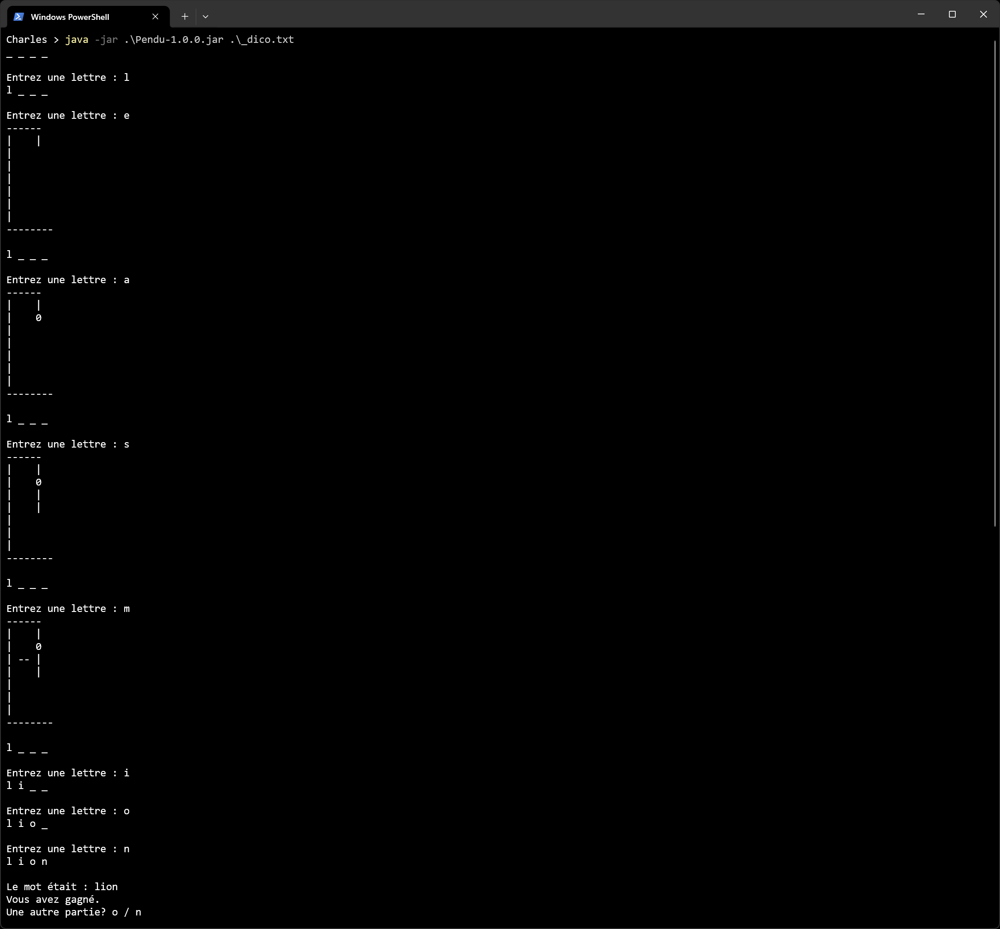

# Projet Jeu du Pendu

Copyright © 2025 Charles Theetten  
Tous droits réservés.  
Ce document est distribué sous licence CC BY-NC-ND 4.0.

## 1. Description

Ce fichier décrit le programme du jeu du Pendu que j'ai écrit en Java.

Les fonctionnalités sont les suivantes :

- Jeu en mode console avec interface textuelle
- Sélection de mots à partir d'un fichier
- Nombre d'essais limité à 7
- Affichage progressif du pendu en ASCII art
- Possibilité de jouer plusieurs parties consécutives

Une vue d'ensemble est présentée ci-dessous.

## 2. Aperçu



## 3. Lancement

```
- gradlew run --console=plain --args="dico.txt" # À partir des sources
- java -jar Pendu-1.0.0.jar dico.txt            # À partir de l'archive
```

## 4. Structure

```
/
├── src/
│   └── main/                                   # Code principal de l'application
│       ├── java/                               # Code source Java
│       │   └── abitodyssey/pendu/              # Package principal
│       │       └── Main.java                   # Classes
│       └── resources/                          # Ressources de l'application
│           ├── messages.properties             # Messages par défaut
│           ├── messages_en.properties          # Messages en anglais
│           └── messages_fr.properties          # Messages en français
├── build.gradle.kts                            # Configuration du build Gradle
└── settings.gradle.kts                         # Configuration du projet Gradle
```

## 5. Pseudo-code

##### PROGRAMME PRINCIPAL

```
DÉBUT
   TANT QU'on souhaite jouer
      Sélectionner   mot
      Appeler        start
   FIN TANT QUE
FIN
```

##### PROCÉDURE START

```
DÉBUT
   Initialiser essais
   Initialiser motAffiché

   Afficher    motAffiché

   TANT QUE essais < 7 ET motAffiché != mot
      Saisir lettre

      SI mot contient lettre
         Mettre à jour  motAffiché
      SINON
         Afficher       pendu
         Incrémenter    essais
      FIN SI

      Afficher motAffiché
   FIN TANT QUE

   Afficher résultat
FIN
```
