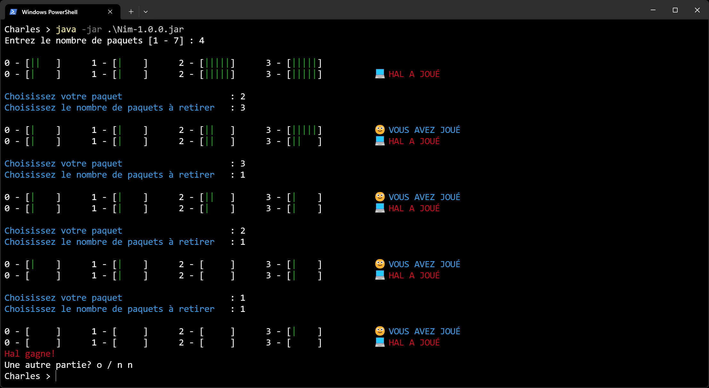

# Projet Jeu de Nim

Copyright © 2025 Charles Theetten  
Tous droits réservés.  
Ce document est distribué sous licence CC BY-NC-ND 4.0.

## 1. Description

Ce fichier présente le programme du jeu de Nim que j'ai écrit en Java.

Les fonctionnalités sont les suivantes :

- Jeu en mode console avec interface textuelle
- Génération aléatoire de la configuration des paquets
- Stratégie gagnante basée sur la théorie du jeu de Nim
- Possibilité de jouer plusieurs parties consécutives
- Support des couleurs et emojis dans le terminal

Une vue d'ensemble est présentée ci-dessous.

## 2. Aperçu



## 3. Lancement

```
- gradlew run --console=plain             # À partir des sources
- java -jar Nim-1.0.0.jar                 # À partir de l'archive
```

## 4. Structure

```
/
├── src/
│   └── main/                             # Code principal de l'application
│       ├── java/                         # Code source Java
│       │   └── abitodyssey/nim/          # Package principal
│       │       └── Main.java             # Classes
│       └── resources/                    # Ressources de l'application
│           ├── messages.properties       # Messages par défaut
│           ├── messages_en.properties    # Messages en anglais
│           └── messages_fr.properties    # Messages en français
├── build.gradle.kts                      # Configuration du build Gradle
└── settings.gradle.kts                   # Configuration du projet Gradle
```

## 5. Pseudo-code

##### PROGRAMME PRINCIPAL

```
DÉBUT
   TANT QU'on souhaite jouer

      Appeler  initGame
      Appeler  runGame

   FIN TANT QUE
FIN
```

##### PROCÉDURE INITGAME

```
DÉBUT
   RÉPÉTER
      Saisir      nombre de paquets
      Valider     saisie
   JUSQU'À saisie valide

   Initialiser    tableau paquets

   POUR chaque paquet
      Remplir     aléatoirement
      Ajouter     au total d'allumettes
   FIN POUR
FIN
```

##### PROCÉDURE RUNGAME

```
DÉBUT
   Calculer       XOR des paquets
   Déterminer     premier joueur
   Afficher       paquets

   TANT QU'il reste une allumette

      SI humain doit jouer
         Saisir      paquet et nombre d'allumettes
         Retirer     allumettes du paquet
      SINON
         Calculer    coup optimal
         Retirer     allumettes du paquet
      FIN SI

      Changer     joueur
      Afficher    paquets

   FIN TANT QUE

   Afficher le résultat
FIN
```
