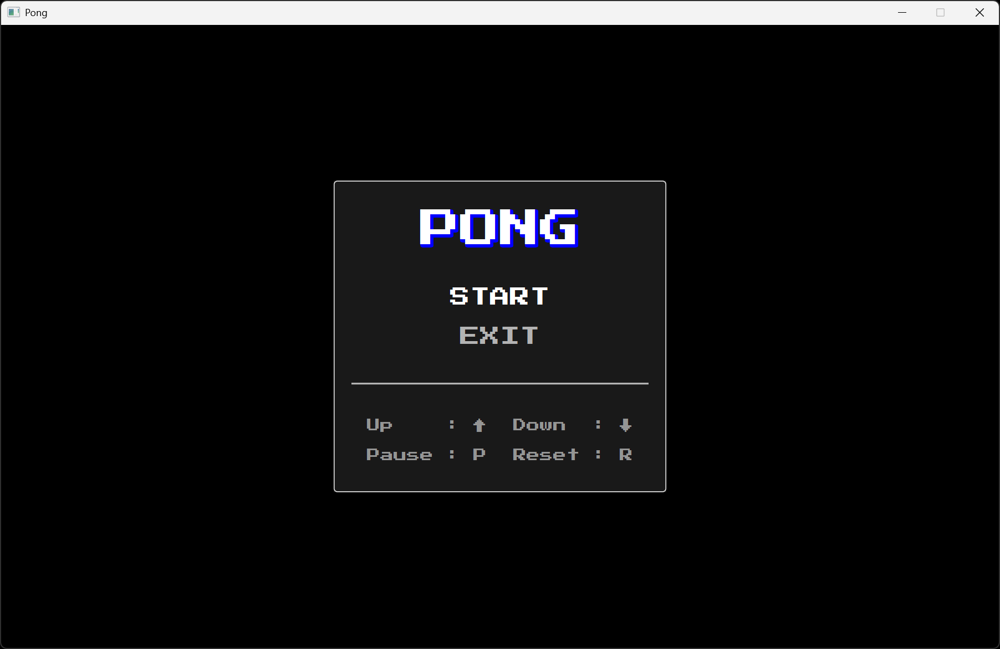
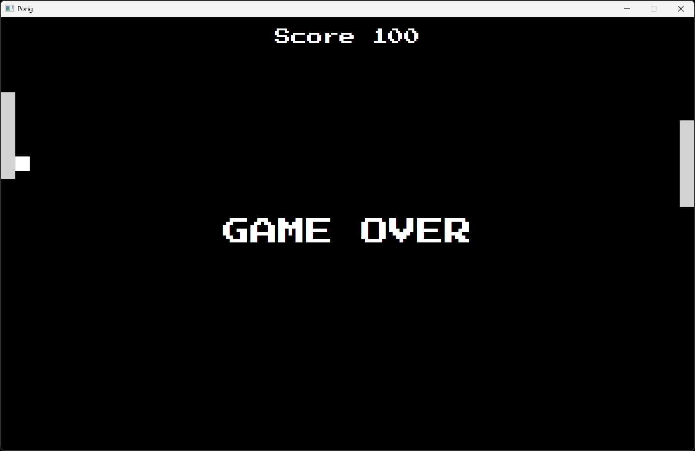

# Projet Pong

Copyright © 2025 Charles Theetten  
Tous droits réservés.  
Ce document est distribué sous licence CC BY-NC-ND 4.0.

## 1. Description

Ce fichier présente le projet du jeu vidéo Pong que j'ai écrit en Java.

Les fonctionnalités sont les suivantes :

- Interface graphique JavaFX
- Menu principal avec options START et EXIT
- Animation fluide du jeu via AnimationTimer
- Contrôle du joueur via les touches fléchées
- (P) pour PAUSE, (R) pour RESET
- L'ordinateur suit la balle automatiquement
- Incrémentation du score à chaque rebond réussi
- Effet rebond avec angle variable selon la position d'impact
- Accélération progressive de la balle
- Effets sonores lors des rebonds sur la raquette du joueur

Une vue d'ensemble est présentée ci-dessous.

## 2. Aperçu





## 3. Lancement

```
- gradlew run                                   # À partir des sources
- gradlew jpackage                              # À partir de l'exécutable
  pong.exe
```

## 4. Structure

```
/
├── src/
│   └── main/                                   # Code principal de l'application
│       ├── java/                               # Code source Java
│       │   ├── module-info.java                # Déclaration du module Java
│       │   └── abitodyssey/pong/               # Package principal
│       │       └── Main.java                   # Classes
│       └── resources/                          # Ressources de l'application
│           └── fonts/                          # Polices
│               └── start2p.ttf                 # Police du menu et de la fenêtre de jeu
│           └── sounds/                         # Sons
│               └── hit.mp3                     # Son joué lors du rebond sur la raquette
├── build.gradle.kts                            # Configuration du build Gradle
└── settings.gradle.kts                         # Configuration du projet Gradle
```

## 5. Pseudo-code

##### BOUCLE DE JEU
```
DÉBUT
   SI état est START
      SI partie non terminée
         Appeler        update
      SINON
         Mettre à jour  état à RESET
         Arrêter        boucle
         Afficher       GAME OVER
      FIN SI
   FIN SI
FIN
```

##### FONCTION UPDATE
```
DÉBUT
   Mettre à jour  position joueur
   Mettre à jour  position CPU
   Mettre à jour  position balle

   SI collision avec mur haut / bas
      Inverser direction verticale
   FIN SI

   SI collision avec joueur
      Mettre à jour  vitesse
      Calculer       angle
      Mettre à jour  direction
      Mettre à jour  score
      Jouer          son
   SINON SI collision avec CPU
      Inverser       direction horizontale
   FIN SI

   SI balle sort à gauche OU score >= 100
      Partie terminée
   FIN SI
FIN
```
