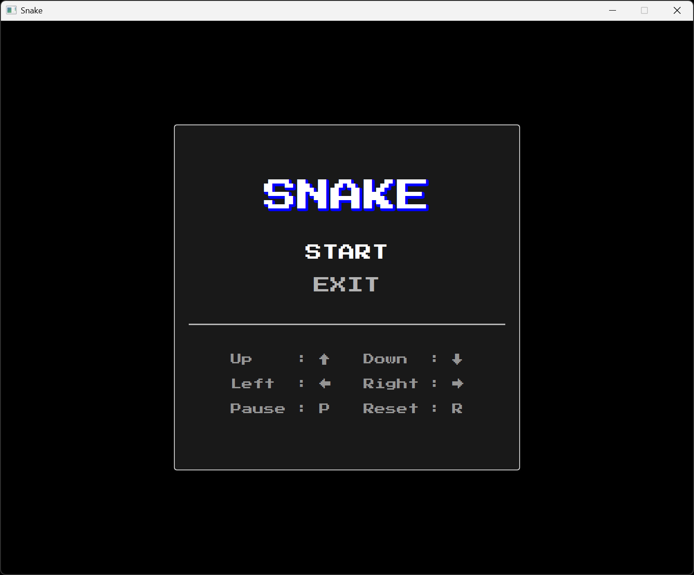
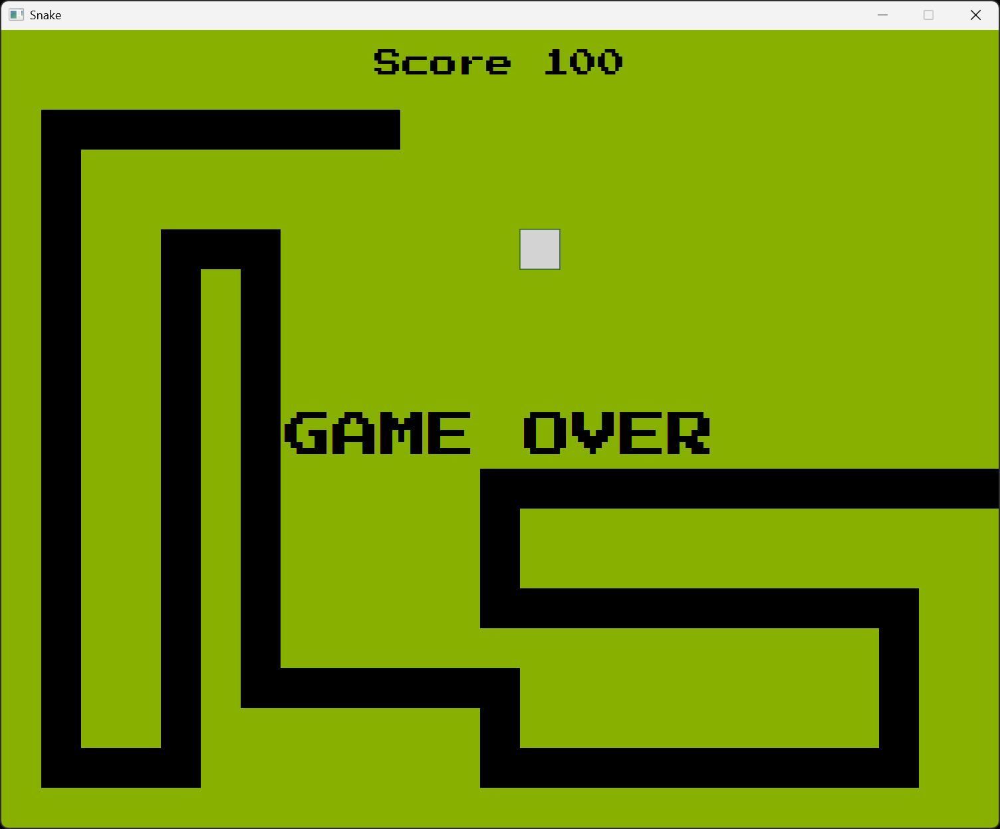

# Projet Snake

Copyright © 2025 Charles Theetten  
Tous droits réservés.  
Ce document est distribué sous licence CC BY-NC-ND 4.0.

## 1. Description

Ce fichier présente le projet du jeu vidéo Snake que j'ai écrit en Java.

Les fonctionnalités sont les suivantes :

- Interface graphique JavaFX pour le jeu Snake classique
- Menu principal avec options START et EXIT
- Animation fluide du jeu via AnimationTimer
- Contrôle du serpent via les touches fléchées
- (P) pour reprendre le jeu, (R) pour réinitialiser
- Détection de collision avec les bords et auto-collision
- Système de croissance du serpent quand il mange
- Génération de nourriture évitant le corps du serpent
- Effets sonores lors de la prise de nourriture

Une vue d'ensemble est présentée ci-dessous.

## 2. Aperçu





## 3. Lancement

```
- gradlew run                                   # À partir des sources
- gradlew jpackage                              # À partir de l'exécutable
  snake.exe
```

## 4. Structure

```
/
├── src/
│   └── main/                                   # Code principal de l'application
│       ├── java/                               # Code source Java
│       │   ├── module-info.java                # Déclaration du module Java
│       │   └── abitodyssey/snake/              # Package principal
│       │       └── Main.java                   # Classes
│       └── resources/                          # Ressources de l'application
│           └── fonts/                          # Polices
│               └── start2p.ttf                 # Police du menu et de la fenêtre de jeu
│           └── sounds/                         # Sons
│               └── eat.mp3                     # Son joué lors de la prise de nourriture
├── build.gradle.kts                            # Configuration du build Gradle
└── settings.gradle.kts                         # Configuration du projet Gradle
```

## 5. Pseudo-code

##### BOUCLE DE JEU
```
DÉBUT
   SI état est START
      SI temps écoulé >= délai
         SI partie non terminée
            Appeler        update
            Appeler        render
         SINON
            Mettre à jour  état à RESET
            Arrêter        boucle
            Afficher       "GAME OVER"
         FIN SI
      FIN SI
   SINON SI état est PAUSE
      Ne rien faire
   FIN SI
FIN
```

##### FONCTION UPDATE
```
DÉBUT
   POUR chaque partie du corps de la fin vers la tête
      Déplacer partie vers partie précédente
   FIN POUR

   Selon direction courante
      Mettre à jour position de la tête
   FIN SELON

   SI collision avec nourriture
      Allonger    serpent
      Incrémenter score
      Jouer       son
      Générer     nouvelle nourriture
   FIN SI

   SI collision avec bords OU auto-collision
      Marquer fin de partie
   FIN SI
FIN
```
