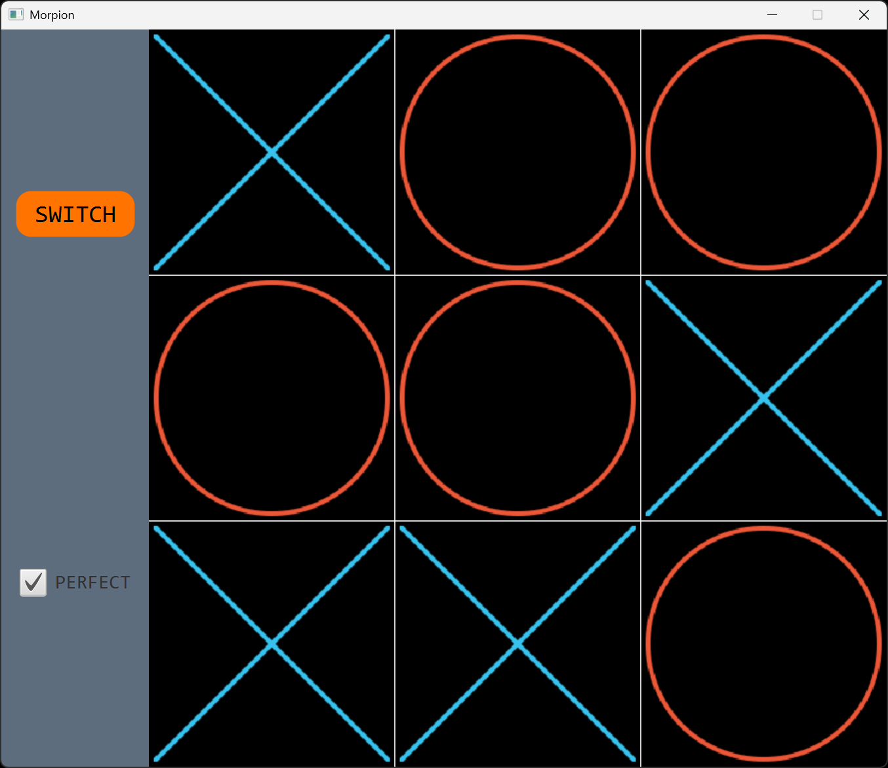

# Projet Morpion

Copyright © 2025 Charles Theetten  
Tous droits réservés.  
Ce document est distribué sous licence CC BY-NC-ND 4.0.

## 1. Description

Ce fichier présente le projet du jeu du Morpion que j'ai écrit en Java.

Les fonctionnalités sont les suivantes :

- Interface graphique JavaFX pour le jeu de Morpion classique
- Menu latéral avec bouton SWITCH pour changer le joueur initial
- Animation fluide du jeu avec affichage des symboles X et O
- Contrôle du joueur via la souris pour placer les symboles
- Adversaire IA avec deux niveaux de difficulté : aléatoire / imbattable
- Détection automatique des alignements et des situations d'égalité
- Possibilité de redémarrer la partie à tout moment
- Alternance automatique des tours entre le joueur et l'IA

Une vue d'ensemble est présentée ci-dessous.

## 2. Aperçu



## 3. Lancement

```
- gradlew run                                   # À partir des sources
- gradlew jpackage                              # À partir de l'exécutable
  morpion.exe
```

## 4. Structure

```
/
├── src/
│   └── main/                                   # Code principal de l'application
│       ├── java/                               # Code source Java
│       │   ├── module-info.java                # Déclaration du module Java
│       │   └── abitodyssey/morpion/            # Package principal
│       │       └── Main.java                   # Classes
│       └── resources/                          # Ressources de l'application
│           ├── views/                          # Vues
│           │   ├── View.css                    # Style CSS de l'interface
│           │   └── View.fxml                   # Structure FXML de l'interface
│           ├── images/                         # Images utilisées dans le jeu
│           │   ├── cross.png                   # Image du symbole X
│           │   └── circle.png                  # Image du symbole O
├── build.gradle.kts                            # Configuration du build Gradle
└── settings.gradle.kts                         # Configuration du projet Gradle
```

## 5. Pseudo-code

##### FONCTION PLAY
```
DÉBUT
   SI clic sur le plateau
      Calculer case

      SI partie non terminée ET case libre
         Placer   X
         Vérifier alignement

         SI partie non terminée
            SI mode imbattable
               num ← O imbattable joue
            SINON
               num ← O joue
            FIN SI

            SI num != -1
               Calculer case
               Placer   O
               Vérifier alignement
            FIN SI
         FIN SI
      FIN SI
   FIN SI
FIN
```
